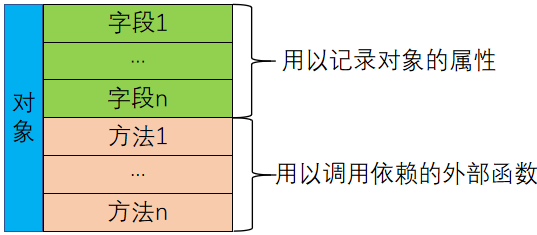

# ExPeriphDriver：一个面向底层设备驱动的驱动库

在开发产品的时候，我们免不了需要用到大量的外部扩展设备。这些设备可能是板载的，也可能是板外的，但不管怎样我们都需要为其编写驱动。在编写这些驱动时经常会出现重复劳动，本驱动库就是我们为避免重复劳动而总结的。我们的初衷是将其设计为一个开放的、可扩展的、易于使用的驱动库。

## 1、开发目标
首先，我们的目的就是要开发我们常用些元器件的驱动，并使用一定的模式规范化这些驱动使其达到可复用的目标。
对于这些驱动很多时候我们会称其为板级支持或者硬件抽象。但我们考虑的并不仅仅是板上的设备。我们希望以容易理解容易使用的方式来设计这些驱动。让使用者可以不需要了解更多的实现细节，而像调用库函数一样简单的使用。
还有我们也希望可已在不同的平台上使用。为了达到这里目的，我们将每个设备独立设计，某一特定对象与外界的耦合只有硬件接口部分，其它部分尽量保持各自的独立。
所以，总结一下我们的开发目标有3点：一是，规范设计；二是，容易使用；三是，不依赖于具体平台。

## 2、总体设计
依据我们的开发目标，我们从三个方面来设计：一是，对象的抽象化，我们从每种设备的特性抽象出相应的对象类型；二是，以对象为依据进行访问，我们开发的库函数在调用时，以参数的形式将具体对象传给函数，并通过对象返回数据；三是，对象的初始化问题，每一个具体对象都有其特殊性，在使用之前需要调用初始化函数配置具体的对象。
首先，我们看对象的抽象化。每一类对象都肯定具备2方面的特性：某些特定的属性和某些特定的操作。比如：设备可能会有地址，状态等。我们将这类属性抽象为字段，每个具体的对象会给与这些字段特定的值。还有我们需要对对象进行读写等操作，而且这些操作依赖于具体的操作平台，我们将这些依赖于具体平台的操作定义为方法，以回调函数的方式操作对象。就是说这些操作实在驱动函数内部没有办法实现的，而且时基于硬件平台的基本操作，如串口的数据发送。具体的抽向结构如下图所示：

接着，我们来考虑对象的初始化操作。对象的初始化通过调用初始化函数来实现。有一些数据必须以参数的形式传递给初始化函数，包括对象方法的回调函数指针、需要指定初值的字段值以及初始化设备需要指定的配置参数。采用初始化函数是为了避免必须初始化的参数被遗忘。如回调函数指针、设备地址等。
最后，我们来设计按对象访问。我们抽象对象的目的就是为了能独立访问同类型对象。所以我们在设计访问函数时，将对象作为参数传递我们要调用的函数。这样我们在访问多个对象时，各个对象的访问是互不打扰的。所以我们将抽象的对象定义为我们希望的结构类型。

## 3、应用方式
我们已经设计了对象和具体的实现方式。我们还需要考虑一下其应用方式。根据前面的设计，我们要使用某一驱动也需要做三方面的工作：声明对象、初始化对象、执行对象调用。具体如下：

 

先说对象的声明，每类对象根据实际情况声明对象，名称无限制，只要符合变量的命名规则就好。
声明变量后，还需要对该对象初始化才可以使用。每一类对象都有一个初始化函数。在具体应用中调用此函数对对象进行初始化，初始化的参数根据要求以参数形式传递给初始化函数。
初始化完成之后就可以在具体应用中调用相应的函数获取对象参数。调用的函数一般以对象指针为实参，调用完成后可以通过对象的属性得到数据。
此外，所用的对象头文件都汇集在扩展外设配置文件中，所以我们需要将配置文件添加到我们的应用中，并通过宏定义添加我们需要用到对象的头文件，将宏参数定义为0则不使用，定义为1则使用。然后还需要将我们使用的对象的源文件添加到我们的应用项目中就可以了。

## 4、总结说明
本套驱动程序完全开源，并会根据使用情况随时修正和新增。同时，任何人都可以使用和修改！并欢迎交流和浏览我们的博客：
- CSDN：https://blog.csdn.net/foxclever
- 博客园：https://www.cnblogs.com/foxclever/
- 同时欢迎关注我们的微信公众号：“木南创智”

